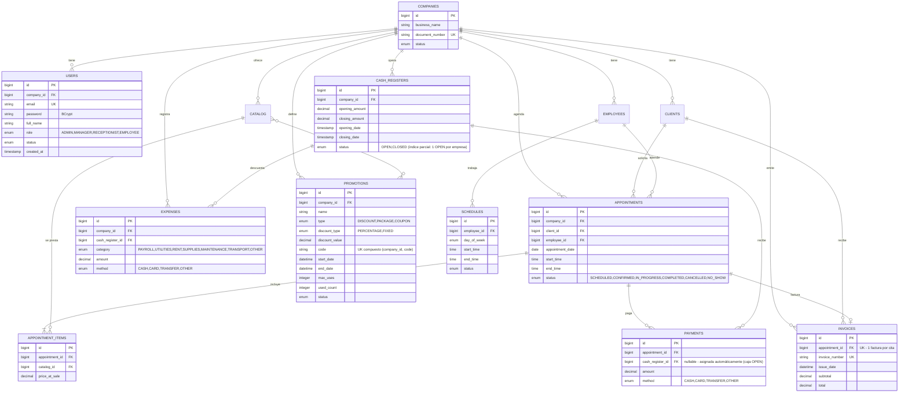

# BookFlow — Diagrama Entidad-Relación

> Generado en la auditoría del 26/08/2026 a partir de las entidades JPA reales (`@Entity`) y migraciones Flyway V1–V14.



## Fórmulas financieras implementadas

```
expectedCash   = openingAmount + Σ pagos CASH − Σ gastos CASH
cashDifference = closingAmount − expectedCash
netResult      = Σ pagos (todos los métodos) − Σ gastos (todos los métodos)
```

*Nota: el resumen financiero se calcula en tiempo real en `CashRegisterServiceImpl.toResponse()`, no se persiste.*
