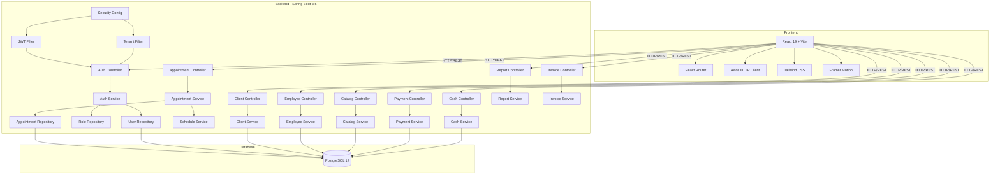
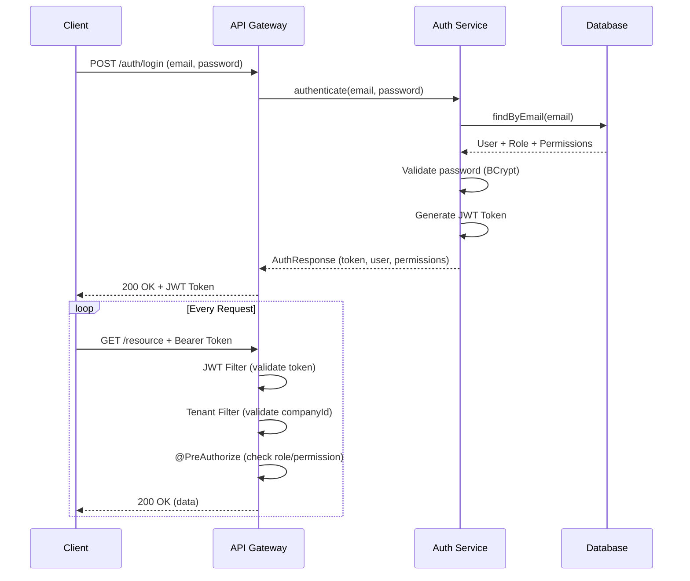
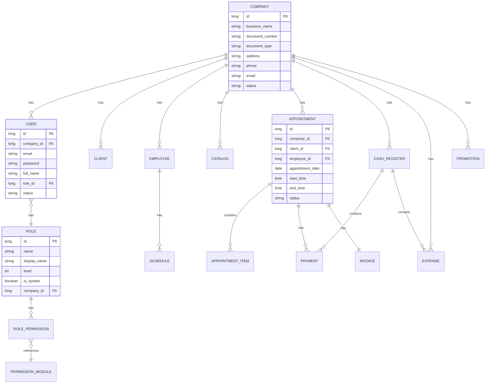

# Arquitectura de BookFlow

## Diagrama de Componentes



## Flujo de Autenticación



## Modelo Multi-Tenant



## Arquitectura en Capas

```
┌─────────────────────────────────────────────────────┐
│                    PRESENTATION                      │
│  ┌─────────────────────────────────────────────┐    │
│  │  React Components (Pages, Layout, Modals)   │    │
│  └─────────────────────────────────────────────┘    │
│  ┌─────────────────────────────────────────────┐    │
│  │  Services (API calls with Axios)            │    │
│  └─────────────────────────────────────────────┘    │
├─────────────────────────────────────────────────────┤
│                     BUSINESS                         │
│  ┌─────────────────────────────────────────────┐    │
│  │  Controllers (REST endpoints)               │    │
│  │  - @PreAuthorize (role-based access)        │    │
│  │  - @Valid (input validation)                │    │
│  └─────────────────────────────────────────────┘    │
│  ┌─────────────────────────────────────────────┐    │
│  │  Services (business logic)                  │    │
│  │  - @Transactional (data integrity)          │    │
│  └─────────────────────────────────────────────┘    │
├─────────────────────────────────────────────────────┤
│                      DATA                            │
│  ┌─────────────────────────────────────────────┐    │
│  │  Repositories (Spring Data JPA)             │    │
│  └─────────────────────────────────────────────┘    │
│  ┌─────────────────────────────────────────────┐    │
│  │  Entities (JPA + Hibernate)                 │    │
│  └─────────────────────────────────────────────┘    │
│  ┌─────────────────────────────────────────────┐    │
│  │  Migrations (Flyway V1-V18)                 │    │
│  └─────────────────────────────────────────────┘    │
├─────────────────────────────────────────────────────┤
│                  SECURITY LAYER                      │
│  ┌─────────────────────────────────────────────┐    │
│  │  JWT Authentication Filter                  │    │
│  │  Tenant Isolation Filter                    │    │
│  │  Role-Based Authorization (@PreAuthorize)   │    │
│  └─────────────────────────────────────────────┘    │
└─────────────────────────────────────────────────────┘
```

## Stack Tecnológico

| Capa | Tecnología | Propósito |
|------|-----------|-----------|
| Frontend | React 19 + Vite 6 | SPA moderna con HMR |
| Routing | React Router 7 | Navegación client-side |
| HTTP | Axios | Comunicación con API |
| Estilos | Tailwind CSS 4 | Utility-first CSS |
| Animaciones | Framer Motion | Transiciones suaves |
| Backend | Spring Boot 3.5 | API REST robusta |
| Seguridad | Spring Security + JWT | Autenticación stateless |
| ORM | Spring Data JPA + Hibernate | Mapeo objeto-relacional |
| DB | PostgreSQL 17 | Base de datos transaccional |
| Migraciones | Flyway | Versionado de esquema |
| API Docs | Springdoc OpenAPI | Swagger UI automático |
| Testing | JUnit 5 + Mockito | Tests unitarios e integración |

## Decisiones de Diseño

### Multi-Tenant con `company_id`
- **Por qué**: Aislamiento completo de datos por empresa sin complejidad de esquemas separados
- **Cómo**: Cada tabla tiene `company_id` como FK, el `TenantFilter` valida acceso
- **Ventaja**: Simple, eficiente, fácil de mantener

### JWT Stateless
- **Por qué**: Escalabilidad horizontal, sin sesiones en servidor
- **Cómo**: Token contiene email, se valida en cada request
- **Consideración**: Token blacklist para revocación (pendiente)

### Roles jerárquicos con niveles
- **Por qué**: Control granular de acceso sin configuración compleja
- **Cómo**: Nivel numérico (20-100), `@PreAuthorize` verifica nivel mínimo
- **Ejemplo**: EMPLOYEE(20) < RECEPTIONIST(40) < MANAGER(60) < ADMIN(80) < SUPER_ADMIN(100)

### Flyway para migraciones
- **Por qué**: Versionado controlado del esquema, reproducibilidad
- **Cómo**: Archivos SQL versionados (V1-V18), ejecución automática
- **Ventaja**: Histórico completo de cambios en BD
